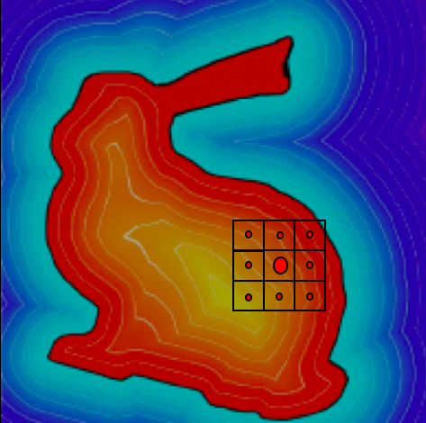

# ConvSDF

[SmoothParticleNets](https://cschenck.github.io/SmoothParticleNets)

## Description

The ConvSDF layer is the other primary layer in addition to the ConvSP layer.
ConvSDF stands for Signed Distance Field Convolution.
The purpose of this layer is to enable particle-object interactions.
The particles are represented as a list of coordinate locations.
The objects are represented as signed distance fields (SDFs).
SDFs are functions that take in a point in space relative to the object and return the signed distance to the closest point on the surface of the object, where the sign indicates if the query point is inside the object (negative) or outside (positive).
For ConvSDF, this function is represented as a lookup table in the form of a grid.
ConvSDF accepts a grid with the SDF values for each grid cell filled in, then performs linear interpolation when looking up the SDF value for a specific point.

ConvSDF works as follows.
ConvSDF operates on sets of query locations, but for simplicity the following describes a single query location.
For a given query point, ConvSDF places a convolutional kernel around that point's location in space.
Then it looks up the SDF values at the center of each of the kernel cells.
This is then convolved with a set of weights in the same manner as a standard convolutional layer, the values are multiplied by a set of weights and then summed.
The following diagram illustrates this process.



The SDF field is shown as a heatmap, with the object boundry shown in black.
The large red dot is the query location, with the smaller red dots showing the kernel cell centers.
The output of ConvSDF is the convolved value for the given query location.

The ConvSDF layer is given the pre-computed SDF grids; it does not compute grids from mesh files.
That must be done externally.
SmoothParticleNets does not include any tools to do this (although some can be found by searching online).
This was done intentnionally to reduce the dependencies that this library requires.
Furthermore, for simplicity, ConvSDF assumes the origin of all the SDF grids is the bottom corner grid.
Ensure that when generating SDF grids that you note if the origin in the mesh file differs from the bottom corner of the grid and ensure you update all poses to take this into account.
SDFs in 1D or in 4+D are not really well-defined, so for now ConvSDF only supports 2D or 3D.

One common usecase for ConvSDF is to compute when particles are inside objects and how to move them away from the object.
This can be done by using ConvSDF to first compute which particles have a negative SDF value, and then by using another ConvSDF layer with fixed +1/-1 weights to compute numerical gradients.
Multiplying the gradients by the distance yields the vector to move the particle by.

ConvSDF is implemented as a subclass of torch.nn.Module.
This allows it to be used in the same manner as any other PyTorch layer (e.g., conv2d).
ConvSDF is implemented with gradients for the query locations and the object poses so that it can be used during a backward call.
ConvSdf is impelemented in native code with Cuda support, so it can be evaluated efficiently.

## Example

Assume *locs* is a BxNxD tensor containing the locations of N D-dimensional particles across B batches.
```python
# Let's make a simple SDF grid.
sdf = torch.Tensor([[0.7, 0.5, 0.5, 0.7], [0.5, -0.5, -0.5, 0.5], [-0.5, 0.5, 0.5, -0.5], [0.7, 0.5, 0.5, 0.7]])
# Construct a ConvSDF layer with 5 kernels.
ConvSDF(sdfs=[sdf], sdf_sizes=[1.0], out_channels=5, ndim=2, kernel_size=1, dilation=0.1, max_distance=1.0, with_params=True, compute_pose_grads=True)
# Convolve at the particle locations. Put the object at the origin with no rotation.
new_data = conv(locs, torch.Tensor([[0]]*locs.shape[0]), torch.Tensor([[0.0, 0.0, 0.0, 0.0]]*locs.shape[0]), torch.Tensor([[1.0]]*locs.shape[0]))
```


## Documentation

ConvSDF provides three functions: a constructor, SetSDFs, and forward.
Forward is called by calling the layer object itself (in the same manner as any standard PyTorch layer).

* ### ConvSDF(sdfs, sdf_sizes, out_channels, ndim, kernel_size, dilation, max_distance, with_params=True, compute_pose_grads=False):
    * Arguments
        * **sdfs**[list of torch.Tensor]: The pre-computed SDF grids for every object that may be encountered. During the forward call, specific objects can be selected. When there are multiple objects in a scene, the SDFs are combined using the MIN operator (e.g., when evaluating each at a specific query location, the SDF with the smallest value is used). Each value in the grids should be the distance to the surface of the object and negative iff it is inside the object. 
        * **sdf_sizes**[list of float]: The size of one side of a grid cell for each SDF. The grid cells are assumed to be hypercubes.
        * **out_channels**[int]: Similar to standard convolutions, this is the number of convolutional kernels to create. The output is then a feature vector for each query location. Unlike ConvSP, the input is not an arbitrary feature vector but an SDF, so there is no corresponding in_channels argument.
        * **ndim**[int]: The dimensionality of the coordinate space.
        * **kernel_size**[int or tuple]: The size of the kernel. If a tuple, then len(kernel_size) == ndim must be True. If an integer, the same size is used for each dimension. Kernel sizes must be odd.
        * **dilation**[float or tuple]: The size of a kernel cell. If a tuple, then len(dilation) == nimd must be True. If a float, then the same size is used for each dimension. Unlike standard convolutions, where the size of a kernel cell is fixed by the size of a grid cell (e.g., size of a pixel), the unordered particle sets do not provide that structure, so this size must be specified.
        * **max_distance**[float]: When looking up the SDF value in an SDF grid, if it is larger than this value, this value is used instead. This is useful when query locations may fall outside of the pre-computed SDF grids.
        * **with_params**[boolean]: (optional) If True (default), the parameters of the layer (weights and bias) will be instantiated as torch.nn.Parameters so that they are treated as parameters by PyTorch's built-in operators. If False, then they are added as torch.autograd.Variables and will not be modified by PyTorch directly. This can be useful if desiring fixed (non-trainable) parameters or for debugging.
        * **compuse_pose_grads**[boolean]: (optional) If False, will not compute gradients with respect to the poses of the objects during backpropagation. This can speed up the backward pass when these gradients are not desired.

* ### SetSDFs(sdfs, sdf_sizes):
    * Arguments
        * **sdfs**[list of torch.Tensor]: The pre-computed SDF grids for every object that may be encountered. During the forward call, specific objects can be selected. When there are multiple objects in a scene, the SDFs are combined using the MIN operator (e.g., when evaluating each at a specific query location, the SDF with the smallest value is used). Each value in the grids should be the distance to the surface of the object and negative iff it is inside the object. 
        * **sdf_sizes**[list of float]: The size of one side of a grid cell for each SDF. The grid cells are assumed to be hypercubes.

* ### forward(locs, idxs, poses, scales):
    * Arguments
        * **locs**[BxNxD torch.autograd.Variable]: The batched list of query locations. D must match the ndim argument to the constructor.
        * **idxs**[BxM torch.autograd.Variable]: The indices of the objects to use, where M is the number of objects in the scene. The indices index into the sdfs passed into the constructor. Not every element in the batch must have M objects. Any element that has fewer than M objects may simply set the usused indices to -1.
        * **poses**[BxMxDD torch.autograd.Variable]: The pose of each object in the scene. The first D values are the translation, and the remaining values are the rotation. For 2D, the rotation is a single angle. For 3D, the rotation is a quaternion in xyzw format. Only 2D and 3D are supported. The origina for all objects is the lower corner of its SDF grid.
        * **scales**[BxM torch.autograd.Variable]: The scale for each object, where 0.5 shrinks the object by half and 2.0 doubles the size of the object.
    * Returns
        * **new_data**[BxMxG torch.autograd.Variable]: The result of the convolutions. G is the out_channels argument passed to the constructor. This is a new feature vector for each of the query locations.


