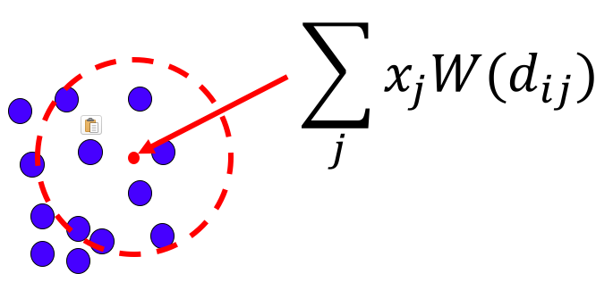
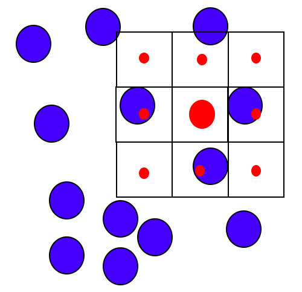

# ConvSP

[SmoothParticleNets](https://cschenck.github.io/SmoothParticleNets)

## Description

The ConvSP layer is the main workhorse layer of SmoothParticleNets.
ConvSP stands for Smooth Particle Convolution.
The ConvSP layer operates on unordered particle sets.
Each particle has a feature vector associated with it, and the ConvSP performs a convolution on these features, similar to how a Conv2D layer performs a convolution on the channels of a feature image.
However, unlike in a standard convolution on a gird, the features associated with each particle here create a continuous vector field across space.

More formally, a set of particles represents a continuous vector field in space.
That is, at everypoint in space it is possible to evaluate the features represented by the particle set.
This is illustrated in the following diagram and equation



Given an arbitrary query location (the red dot), the features of each nearby particle (x_j) are averaged together, weighted based on their distance to the query point using a kernel function W.

This is then used to perform convolutions.
Unlike in the standard convolution, here there isn't a well-defined grid to convolve on.
Instead, the ConvSP layer convolves in free space.
This is illustrated in the following diagram.



In the above 2D case, the kernel used is 3x3.
Given a query location (the large red dot), the kernel is placed on top of that location.
Then the above field lookup equation is used to evaluate the continuous vector field at the center of each kernel cell (small red dots).
The resulting values are then multiplied by kernel weights and summed in the same manner as a standard convolution.
The key difference between ConvSP and a standard convolution is the use of the smoothing kernel average above to allow evaluating the kernel at any arbitrary point in space.


ConvSP is implemented as a subclass of torch.nn.Module.
This allows it to be used in the same manner as any other PyTorch layer (e.g., conv2d).
ConvSP is implemented with gradients so that it can be used during a backward call.
ConvSP is impelemented in native code with Cuda support, so it can be evaluated efficiently.

## Example

Assume *locs* is a BxNxD tensor containing the locations of N D-dimensional particles across B batches and data is a tensor containing a feature vector for each particle.
```python
# Create a ConvSP layer with 5 output channels, 3 size kernel with dilation of 0.05, and a radius of 0.1.
conv = ConvSP(in_channels=data.shape[2], out_channels=5, locs.shape[2], kernel_size=3, dilation=0.05, radius=0.1, dis_norm=False, with_params=True, kernel_fn='spiky')
# The ConvSP layer requires a ParticleCollision layer to generate the neighbor list. The radius of the neighbor list should be the maximum distance a neighor of any kernel cell could be from the center of the kernel, which is radius + kernel_size/2*dilation.
coll = ParticleCollision(ndim=locs.shape[2], radius=(0.1 + 0.05))
# PartileCollision reorders locs and data.
locs, data, idxs, neighbors = coll(locs, data)
# Get the new features. We'll use the particle locations as the query locations, so we won't be passing anything for qlocs.
new_data = conv(locs, data, neighbors)
# new_data is still reordered according to the reordered locs, but we might want them in the original order.
reorder = ReorderData(reverse=True)
locs, new_data = reorder(idxs, locs, new_data)
```


## Documentation

ConvSP provides two functions: a constructor and forward.
Forward is called by calling the layer object itself (in the same manner as any standard PyTorch layer).

* ### ConvSP(in_channels, out_channels, ndim, kernel_size, dilation, radius, dis_norm=False, kernel_fn='default', with_params=True):
    * Arguments
        * **in_channels**[int]: The dimensionality of the feature vectors associated with each particle.
        * **out_channels**[int]: Similar to standard convolutions, this is the number of convolutional kernels to create. The output is then a feature vector for each query location.
        * **ndim**[int]: The dimensionality of the particle's coordinate space.
        * **kernel_size**[int or tuple]: The size of the kernel. If a tuple, then len(kernel_size) == ndim must be True. If an integer, the same size is used for each dimension. Kernel sizes must be odd.
        * **dilation**[float or tuple]: The size of a kernel cell. If a tuple, then len(dilation) == nimd must be True. If a float, then the same size is used for each dimension. Unlike standard convolutions, where the size of a kernel cell is fixed by the size of a grid cell (e.g., size of a pixel), the unordered particle sets do not provide that structure, so this size must be specified.
        * **radius**[float]: The radius to use when computing the smoothing kernel average. Only particles within this distance of the query location are used in the average.
        * **dis_norm**[boolean]: (optional) If true, the features in the smoothing kernel average will be divided by the distance from the query location to the particle. This normalization can be useful for some computations.
        * **kernel_fn**[string]: (optional) The kernel function to use in the smoothing kernel average. SmoothParticleNets provides many options for the kernel. Refer to kernels.py for a complete list.
        * **with_params**[boolean]: (optional) If True (default), the parameters of the layer (weights and bias) will be instantiated as torch.nn.Parameters so that they are treated as parameters by PyTorch's built-in operators. If False, then they are added as torch.autograd.Variables and will not be modified by PyTorch directly. This can be useful if desiring fixed (non-trainable) parameters or for debugging.

* ### forward(locs, data, neighbors, qlocs=None):
    * Arguments
        * **locs**[BxNxD torch.autograd.Variable]: The batched list of particle locations. D must match the ndim argument to the constructor.
        * **data**[BxNxK torch.autograd.Variable]: The feature vectors associated with each particle. K must be the same as the in_channels argument to the constructor. 
        * **neighbors**[BxMxF torch.autograd.Variable]: The pre-computed neighbor list for each query location. This can be generated using the ParticleCollision layer. This is necessary for evaluating the kernel smoothing average.
        * **qlocs**[BxMxD torch.autograd.Variable]: (optional) The set of locations to perform convolutions around. Usually this will be the same as the particle locations, but not always. If this argument is not provided, locs is used.
    * Returns
        * **new_data**[BxMxG torch.autograd.Variable]: The result of the convolutions. G is the out_channels argument passed to the constructor. This is a new feature vector for each of the query locations.

